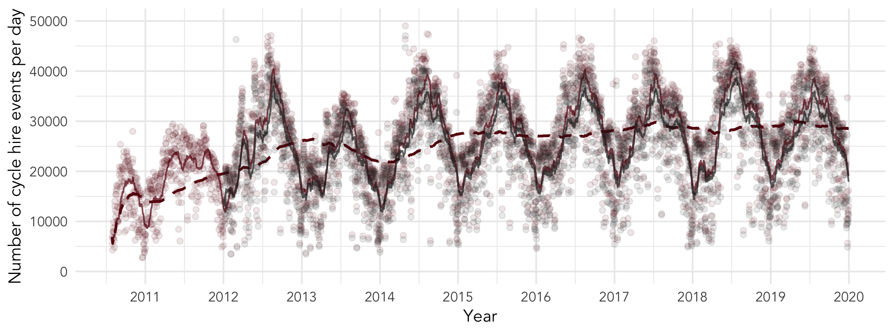
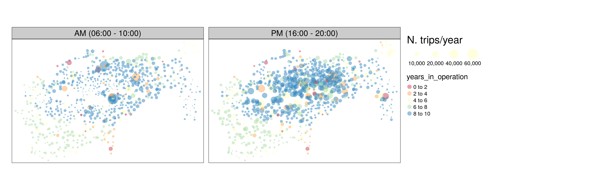

Is the London Cycle Hire Scheme becoming more inclusive? An evaluation
of the shifting spatial distribution of uptake based on 70 million trips
================

<!-- README.md is generated from README.Rmd. Please edit that file -->

## Reproducing the results

To reproduce the analysis presented in this paper, a good starting point
is loading a sample of the datasets used. You can do this starting with
a 5% sample of the raw cycle hire trip records as follows:

``` r
# for released version
# u = "https://github.com/Robinlovelace/cycle-hire-inclusive/releases/download/0.0.1/data_raw_5pc.fst"
# download.file(u, "data_raw_5pc.fst")
# for piggyback version
piggyback::pb_download("data_raw_5pc.fst") # downloads a subset of the data
library(lchs) # loads all packages needed to reproduce the results
source("R/plan.R")
plan
```

To reproduce all the results in the paper, you can make the plan with:

Visualise the build and a sample of the data from the project as
follows:

``` r
drake::vis_drake_graph(plan, targets_only = TRUE, make_imports = FALSE)
trips_df = drake::readd(trips_df) # get the clean trips dataset
head(trips_df)
```

You can reproduce many of the results in the main paper using this
sample of the data. The following, for example, produces a graph showing
the number of hires per
year:

``` r
g = lchs_check_dates(trips_df %>% filter(year_month > as.Date("2014-01-01")))
g
```

To reproduce all the results, clone or download the repo, uncomment the
relevant lines in `R/plan.R`, and re-run the `drake::make(plan)` command
demonstrated above.

# Abstract

Policies aiming to enable cycling uptake in cities, and cycle hire
schemes in particular, are often assumed to primarily benefit the
privileged. This framing has played-out in academic research, with many
papers exploring the relationship between pro-cycling interventions and
existing inequalities. Indeed, a growing body of evidence suggests that
— like many types of public investment — cycle hire schemes have
tended to be constructed in wealthy areas and that growth in their usage
tends to be fastest among young, high income groups, mirroring
inequalities in other types of cycling uptake. However, little research
has explored inequalities of cycle hire scheme usage over time, or
*relative* to other types of cycling.
<!-- and, more broadly, compared with usage of motorised modes. -->
<!-- This is an important omission given that the alternative to investment in cycle hire schemes may be investment in motorised transport systems, which could perform worse from an equity and environmental justice perspective. -->
Reflecting on the research and policy context, this paper explores the
uptake of the London Cycle Hire Scheme (LCHS), a flagship scheme that
set out with the aim of ‘normalising’ cycling, geographically and
between high and low income areas.
<!-- Although the study does not compare equality impacts with other types of transport investment, it does take a step in this direction. -->
We found that, contrary to the trend for increasing segregation and
geographic inequalities in many domains, the usage (and inferred
benefits) of the LCHS have become increasingly geographically
distributed across London over time. Our study shows that cycle hire
schemes can be designed and expanded in ways that benefit a wide range
of people, including those from low income areas, and that new cycle
hire docking stations in poorer areas can succeed.

<!-- # Paper -->

# Introduction

Since the turn of the 21<sup>st</sup> Century, cycling has risen to
prominence in transport plans worldwide. Once perceived as an old
fashioned mode, recent evidence on its ability to support pressing
political priorities — including air quality, congestion, liveable
streets, and health/well-being — has led to policies explicitly enabling
cycling uptake in many cities including Beijing, New York, Santiago and
London.

Bike share schemes (BSS) such as the LCHS aim to address two of the
major barriers to cycling: lack of access to a working bike and the
perception that cycling is only for certain (often young, male, high
income) groups by providing 24/7 access to bikes at relatively low costs
(compared with motorised modes, and driving a private automobile in
particular) (Shaheen, Guzman, and Zhang 2012), enabling a wide range of
people to access the benefits of cycling (Goodman, Green, and Woodcock
2014). BSSs are inevitably localised policies, enabling bikes to be
rented at multiple docking stations located across (usually central)
parts of cities, especially near major trip attractors, and the data
they produce provides a rich source of information on how cycling levels
are changing and shifting (O’Brien et al. 2014).

Cycle hire is a rapidly evolving phenomenon. The first schemes allowed
the use of bicycles for free (‘First generation’), or through a coin
deposit (‘Second generation’), which often resulted in problems of
financing and theft. The ‘Third generation’ schemes, to which the LCHS
belongs, allow users to access and return bikes to dedicated docking
stations, typically with only a bank card or other type of payment
device, which makes the service more viable. ‘Fourth generation’ smart
bikes with integrated locking technology can communicate with user smart
phone apps, removing the need to communicate with a station or terminal,
enabling journeys to start or end away from traditional docking
stations. This free-floating operational ‘dockless’ bikeshare model, can
also run as a hybrid model composed of docking stations and
free-floating parking zones shown on a map. Globally, there has been an
emergence of schemes funded primarily by private capital and with lower
installation times, accounting for the majority of growth in bike share
fleets worldwide since 2016 (Fishman and Schepers 2018). Continued
growth and the private capital led operations makes assessment of
bikeshare important, to monitor their performance compared with other
types of sustainable transport intervention, understand how bikeshare is
used, where and by whom and to ensure that future cycle hire policies
support, rather than hinder, local policy objectives.
<!-- The focus of CHSs are varied. -->
<!-- From a transport planning perspective, they are seen as a way to replace short journeys, otherwise made by congested taxi or metro systems, with active transport; from a health perspective they are a way to encourage a more active population; and from a political perspective, they often represent an opportunity to improve the image of the urban environment [@bauman_unrealised_2017]. -->

In this context the aim of this paper is to better understand the extent
to which cycle hire schemes have been adopted by users from high and low
income areas over time. Using data from the London Cycle Hire Scheme
(LCHS), first launched in 2010 and continuously expanded since, we
explore usage patterns in high and low income areas. After a review of
literature on the growth of cycle hire from a social equity perspective,
in the next section, the paper describes the LCHS in detail, outlines
methods for comparing usage levels over time across geographic areas,
and presents the findings. We discuss the findings in relation to
pressing policy and research questions and conclude with recommendations
for transport policymakers and
researchers.

# Background

<!-- This section discusses trends in bicycle sharing schemes, determinants of their uptake, and their levels of inclusiveness. -->

Bicycle sharing systems (BSS) have been created in many cities to
support multiple policy objectives, especially improved health, air
quality and livability (Fishman 2016). Modern docked cycle hire schemes
have been in operation since 1995, with the launch of a scheme in
Copenhagen (DiDonato, Herbert, and Vachhani 2002). They have taken off
since the early 2000s, with the greatest absolute period of growth
occurring between around 2010 and 2015, after which the rate of new
installations has dropped off (Figure
@ref(fig:global-growth)).

<div class="figure" style="text-align: center">


<p class="caption">

Growth in docked cycle hire schemes worldwide in terms of docking
stations by continent.

</p>

</div>

European cities pioneered shared cycle mobility, with schemes in cities
such as Amsterdam (The Netherlands) and Renne (France) demonstrating the
concept’s feasibility (DiDonato, Herbert, and Vachhani 2002), and the
number of European schemes has continued to grow. Asia saw very rapid
uptake of sharing schemes from 2010. Seven of the top ten largest
schemes by number of docking stations and number of bicycle have been
launched in Chinese cities between 2008 and 2011 (see Figure
@ref(fig:global-stations-cycles)). North and South America have seen
substantial interest in docked cycle hire schemes, although on a smaller
scale than those in Europe and Asia, and a handful of cycle hire schemes
have been launched in Australia. Within this global overview, the London
BSS is an important player, ranking 8th in the top schemes by number of
docking stations and launching relatively early in
2010.

<div class="figure" style="text-align: center">


<p class="caption">

Cycle hire schemes worldwide by continent, comparing number of docking
stations with number of cycles.

</p>

</div>

## Determinants of cycle hire scheme usage

### Who uses cycle hire schemes?

Much research has been devoted to the question of who uses BSS. In
general, reflecting cycle usage overall, BSS users appear to be younger
adults, have higher incomes than average, male and are more likely to
own a bicycle (Ogilvie and Goodman 2012; Fishman, Washington, and
Haworth 2013; Zhao et al. 2019; Soltani et al. 2019; Heinen,
Kamruzzaman, and Turrell 2018). These socio-economic characteristics may
seem <!--are--> similar to those that are generally linked to cycling
(see e.g. Heinen, Wee, and Maat 2010).
<!-- A survey by shared mobility organisation CoMoUK found that 21% of BSS users in the UK were on an income of less than £20,000, 9% on an income of less than £10,000, and less than 1% were unemployed.^[ -->
<!-- See https://como.org.uk/wp-content/uploads/2019/10/CoMoUK-Bike-Share-Survey-2019-web-2.pdf -->
<!-- ] -->
<!-- Whilst this hides variation depending on each scheme, it however highlights that low income users constitute a substantial share of overall BSS use. -->
<!-- Members of BSS have been found to be more likely to own and use private bicycles [@fishman_bike_2013]. -->

<!-- While the characteristics of BSS users and other cyclists may seem similar -->

However, some research reveals certain differences between cyclists
using BSS and ‘normal’ cyclists that imply BSS can open up cycling to a
wider range of users.
<!-- @buck_are_2013, for example, report that in Washington, D.C., BSS users are more likely to be female, younger, from lower (household) income backgrounds, and own fewer cars and bicycles than other cyclists. -->
Buck et al. (2013, 112) found in the Washington, D.C., region that,
compared with regular cyclists, bike-share users “are more likely
female, younger, have lower household incomes, own fewer cars and fewer
bicycles, and are more likely to cycle for utilitarian trip purposes”.
<!-- I don't think this next bit is that relevant -->
<!-- By contrast,  and Goodman (2012) showed that among members women made fewer trips and men.  -->

### Where are hired cycles used?

Research has focussed on where users ride, partly perhaps driven by an
underlying question of where stations are best placed. BSS stations that
are located in either a city centre and on a university campus are often
well used (Mattson and Godavarthy 2017; Zhang et al. 2016). Other
facilities have been shown to increase use of bicycle sharing stations,
including proximity to housing, train and metro stations, bus stops,
shops, parks, hospitals, and employment sites (Fishman, Washington, and
Haworth 2014; Bachand-Marleau, Lee, and El-Geneidy 2012; Buck et al.
2013; Daddio and Mcdonald 2012; Wang and Lindsey 2019; Rixey 2013; Nair
et al. 2013; Hampshire and Marla 2012; Fuller et al. 2011; Zhao et al.
2019; Mooney et al. 2019).
<!-- (Bachand-Marleau et al., 2012; Buck and Buehler, 2012, Daddio, 2012; Wang et al., 2016; Rixey, 2013; Nair et al., 2013; Hampshire and Marla, 2012; Fuller et al., 2011, Zhao et al., 2019, Wang et al., 2019). -->
<!-- Docking stations tending to be placed in areas of high transport demand [@de_chardon_bicycle_2017]. -->

Cycling organisations have advocated that BSS stations should be located
not only on their potential use, but also on their potential to provide
new mobility options to disadvantaged transport populations (League of
American Bicyclists and Club 2015; Sustrans 2019). In Boston, Chicago,
Denver, Seattle, and New York City (US), Aultman-Hall and Ursaki (2015)
found significant differences in access based on race and income
variables. In Porto Alegre, Recife, Rio, Salvador and Sao Paulo
(Brazil), Duran et al. (2018) found that the coverage of bicycle-sharing
systems favoured wealthier and centrally located neighborhoods with
higher proportion of white
population.

## Bicycle sharing schemes, transport equity and social inclusion

<!-- Improving mobility and city liveability are often the primary objectives of CHS, but they have the potential to tackle or reinforce social inequalities. -->

<!-- ref? -->

BSS have the potential to enable a wider range of people to benefit from
access to cycling for daily transport as it offers an affordable form of
transport. The LCHS costs £2 for making a potentially unlimited number
of rides of less than 30 minutes over a 24 hour period of use, for
example which is less than half the price of a typical single use metro
(tube) ticket.\[1\] However, the lowest rates, such as the £90 for an
annual ticket bought online, excludes many in low income areas. Another
benefit of accessing a bike through a BSS is that maintenance and
storage are paid for by the operator. Bike theft represents another
potential problem that can be mitigated by cycle hire schemes. All these
may be of greater importance in low income areas, where the barriers to
buying, storing, repairing, and bike theft will likely be greater. A
study on barriers to bikeshare on traditionally under-served
neighbourhood in the US (Portland State University et al. 2017, 1) found
that some of the most common barriers to bicycling cited by lower-income
people of color were issues that bike share could address, such as: not
having a bike or related gear (47%); not having a safe place to leave a
bike where they need to go (36%); the expense of buying a bike or
related gear (41%); and not having a safe place to store a bike at home
(32%). Inequalities related to BSS are directly linked to use and
access, and consequent benefits in accessibility, health.
<!-- Not sure where this direct quotation ends? -->

As discussed in the preceding paragraphs, BSS tends to be associated
with higher socio-economic groups and higher incomes. However, the use
of schemes is also dependent on other aspects of social disadvantage.
Transport for London (TfL 2016), for example, found that casual users
generally have lower incomes than annual members, implying that users
with higher incomes would make more use of economically beneficial
long-term subscriptions. Similarly, Ogilvie and Goodman (2012) reported
that registered users of the London scheme were more likely living in
socioeconomically advantaged areas, indicating that may also have higher
disposable income. Other studies indicated that users are most likely to
be middle-class (Clark and Curl 2016). Interestingly, the use of the
scheme among registered users of the LCHS has been found to be more
common for individuals living in more deprived areas: they made more
trips than individuals in wealthier areas according to Ogilvie and
Goodman (2012), suggesting different dynamics than those identified in
studies of American BSS. A recent example in Glasgow also demonstrates
that BSS can gain high uptake among dissadvantaged groups, provided
sufficient support. The ‘[Bikes for
All](https://www.nextbike.co.uk/en/news/nextbike-provides-bikes-for-all-as-scheme-celebrates-community/)’
BSS scheme was supported by a parallel package of engagement activities
and measures to overcome barriers (particularly financial barriers) to
shared mobility faced by diverse groups including along ethnic, housing
tenure and employment lines. The results from follow-up research into
the scheme’s impact shows that providing additional support, in addition
to simply putting shared bikes in low income areas, can ensure high
uptake among a wide range of disadvantaged groups (Yates and Whyte
2019).\[2\]

<!-- Next line repeats previous content. -->

<!-- Moreover, (registered) CHS users have been found to be more likely male (Ogilvie and Goodman, 2012; Clark and Curl, 2016) and more likely white (Clark and Curl (2016). -->

<!-- Both are known correlates of income. -->

<!-- Being unaware of BSS limits the possibility to use them. -->

<!-- Education has also been found to relate to awareness of BSS [@bernatchez_knowing_2015]. -->

Accessibility to and awareness of BSS is also not equally spread across
the population. Areas with no docking stations have been found to have
lower levels of awareness of shared mobility as a transport option
(Bernatchez et al. 2015). BSSs tend to be more easily accessible to
higher socio-economic groups (e.g. Ricci 2015) and one reason offered
for this is that stations may not be placed in less economically
advantaged areas. Ogilvie and Goodman (2012) reported that registered
users of the London scheme were more likely to live in socioeconomically
advantaged areas and areas with high cycling levels.
<!-- It is important to note that (other) bicycle infrastructure is often first placed in more affluent areas. -->
<!-- Demand for bicycle sharing is higher in areas with more bicycle infrastructure [@el-assi_effects_2017]. -->
<!-- Common sense suggests that proximity to docking stations increases usage, something that has been found in several studies [@fishman_factors_2015; @bernatchez_knowing_2015; @fuller_use_2011]. -->
<!-- However, a recent cohort study revealed that residential proximity does not significantly predict the likelihood of using a BSS, suggesting that placement of docking stations may not be a primary cause of inequalities in BSS usage [@heinen_public_2018]. -->

Overall, there is little evidence of the <!--overall--> transport equity
outcomes from cycle hire schemes. One recent paper on the role of cycle
hire schemes in transport equity, stated that “most BSS typically
benefit the privileged” (Chardon 2019, 401). In the same direction,
Noland (2018, 151) found in Philadelphia that “bikeshare docking
stations in lower income areas are not generating as many trips as in
other areas”. Hosford and Winters (2018) noted the importance of
confounding geographic factors: economically advantaged areas have
better access in some cities, whereas in other cities disadvantaged
areas are better served.
<!-- And Mooney et al., (2019) suggest that modest inequities in access exist in Seattle by sociodemographic characteristics. -->

<!-- ## Cycle hire and equity -->

<!-- Cycle hire schemes have the potential to enable a wider range of people to benefit from access to cycling for daily transport, costing £2 per ride in London (less than a typical metro ticket) or £90 per year if you buy an annual ticket through an online form (a cost that will exclude many in low income areas from this option). TfL [@tfl_santander_2016] found that casual users generally have lower incomes than annual members. -->

<!-- ref? -->

<!-- The benefits of a shared scheme, where maintenance and storage are paid for by the operator, may be of greater importance in low income areas, where the barriers to buying, storing and repairing will be greater. An study on barriers on bike share on traditionally under-served neighbourhood in the US [@portland_state_university_breaking_2017 p.] found that "some of the most common barriers to bicycling cited by lower-income people of color were issues that bike share could address, such as: not having a bike or related gear (47%); not having a safe place to leave a bike where they need to go (36%); the expense of buying a bike or related gear (41%); and not having a safe place to store a bike at home (32%). -->

<!-- Bike theft in deprived areas represents another potential problem that can be mitigated by cycle hire schemes. -->

<!-- todo: verify -->

<!-- The evidence on the overall transport equity outcomes from cycle hire schemes is mixed. -->

<!-- One recent paper is scathing of the role of cycle hire schemes in transport equity, stating that "most BSS typically benefit the privileged" [@de_chardon_contradictions_2019]. In the same direction, Noland [-@noland_bikesharing_2018, p.15] found in Philadelphia that "bikeshare docking stations in lower income areas are not generating as many trips as in other areas". However, Buck et al. [-@buck_are_2013, p.112] found in the Washington, D.C., Region that, compared with regular cyclists, bike-sare users "are more likely female, younger, have lower household incomes, own fewer cars and fewer bicycles, and are more likely to cycle for utilitarian trip purposes". -->

<!-- * [Hosford and Winters 2018](https://doi.org/10.1177/0361198118783107)  -- more of an extended abstract. Calculate share of BSS docking stations by deprivation quantile position. [this](https://www.uvm.edu/sites/default/files/media/TRC_Report_15-011.pdf) does the same. -->

<!-- * [Mooney et al. 2019](https://doi.org/10.1016/j.jtrangeo.2018.11.009) -- equity and dockless bikeshare. -->

<!-- * [Wang and Lindsey 2019](https://doi.org/10.1016/j.tra.2019.01.004) -- accessibility measures discussed -->

<!-- Aspects of equity that are typically considered: -->

<!-- * Demographic : age, sex, ethnic, social groups over-represented among certain types of cycling -->

<!-- * Spatial : inequalities in the provision of cycle infrastructure/services -->

<!-- * Behavioural (cuts across both) : certain demographic groups are more likely to cycle in particular space-times and for particular purposes -->

<!-- Associations between cycling and socio-economics are not straight-forward (context/city/region-specific) -- e.g. association with socio-economics and cycling in Sunderland most likely different to Hackney. -->

<!-- Bikeshare tends to be associated with higher socio-economic groups [@ricci_bike_2015] -- both inclusiveness of access and in usage (see Eugeni's transfer report pp. 17). -->

# The London Cycle Hire Scheme

<!-- This section provides an overview of the LCHS. -->

With an urban population approaching 9 million, London is the largest
city in Western Europe and, housing many the world’s ‘super rich’, has
substantial overseas links (Shrubsole 2019).
<!-- (including tram)Underground/DLRRail  -->
<!-- London plays an important role in the history of bikeshare worldwide, partly due to the political prominence of the UK's capital, and also because it was an early . -->
<!-- London is home to an estimated 93 billionaires, more than any other city . -->
In addition to economic and cultural influence associated with the
super-rich (a driver of high living costs and economic inequalities),
London’s status as an international financial hub and cosmopolitan study
and tourist destination boosts the city’s ‘soft power’ (Bell 2016).\[3\]
On seeing and trying accessible cycling, some of London’s diverse and
generally wealthy visitors may go on to try cycling elsewhere.

Unlike other major high-income cities in the UK (and the world), the
majority of trips in the UK’s capital are made by ‘sustainable’ modes,
with public transport, walking and cycling accounting for 35%, 24% and
2% of trips in 2016 respectively, although cars still account for around
35% of trips, according to London’s
[10](https://www.google.com/url?sa=t&rct=j&q=&esrc=s&source=web&cd=5&ved=2ahUKEwjj6b6pldXlAhV5ShUIHRQZBYQQFjAEegQIAhAC&url=https%3A%2F%2Ftfl.gov.uk%2Fcdn%2Fstatic%2Fcms%2Fdocuments%2Ftravel-in-london-report-10-data.xlsx&usg=AOvVaw3wFwZPyKmV86i71fCoa0Bo)s
Travel report ). Cycling is the fastest growing mode of transport in
London, with trip numbers more than doubling since 2000.\[4\]

LCHS has a direct impact on many London residents who have used the
scheme since its 2010 launch (making London an early adopter). It is
large, boasting the second largest number of bikes of any system
worldwide in 2014 (Fishman 2016).\[5\] The stated aim was to provide “a
major new form of public transport in London, delivering an additional
40,000 cycle trips per day” (Transport for London 2010) (currently the
scheme averages 30,000 hires per day over the year, around double the
initial level of usage, with peaks over 45,000 trips on busy summer
days). Although the scheme currently delivers only around 0.1% of trips
in Greater London overall, it serves a much higher percentage of trips
in the congested central areas during the vital rush hours. By providing
a new form of transport targeting commuters, another important aim was
to relieve peak capacity constraints on the tube and bus network.\[6\]

There has been continued growth in usage of the scheme, as illustrated
in Figure @ref(fig:cycle-hire-chart-daily). The main features of the
graph, which runs from the 30<sup>th</sup> July 2010 to the
30<sup>th</sup> September 2019, correspond to events in the history of
the LCHS, including:

  - LCHS launch in late July 2010, initially with 315 docking stations
    and 5,000 bikes.
  - Expansion in March 2012 to 8,000 bikes and additional 570 stations,
    reflected in the rapid growth in early 2012 shown in Figure
    @ref(fig:cycle-hire-chart-daily).
  - Expansion in December 2013 West and Southwest
    <!-- London ?? bikes and ?? docking stations, --> corresponding with
    a step change in the annual average number of hires after
2014.

<div class="figure" style="text-align: center">



<p class="caption">

Top: Number of cycles hired per day across the London Cycle Hire Scheme,
with TfL daily totals in blue and the totals from the individual trip
records in black, translucent dots representing daily counts, the solid
blue line representing the monthly (30 day) rolling average and dashed
blue line representing the yearly rolling average. Bottom: the extent of
the scheme in 2019 (see <https://i.imgur.com/1rAfJgZ.gif> for an
animated version of the map).

</p>

</div>

<!-- reference needed -->

What was not stated in such policy documents was precisely which social
groups the scheme was expected to be most used by.
<!-- The two groups most associated with the scheme among non-cycling Londoners are, according to stereotype, probably *commuters*, who are typically male, white, young/middle-aged, professional with high-incomes (rather like Boris Johnson was during his term a Mayor) and *tourists* who are assumed to be casual users renting bikes for leisure and fun. -->
<!-- reference needed todo: uncomment above statement if we find a reference supporting it-->
<!-- The scheme also aimed to *diversify* cycling, however. -->
<!-- The idea was (and still largely is) that bikeshare would be a 'gateway drug', reaching people who would not normally cycle and getting them hooked. -->
Delivered as part of a package to “help ‘normalise’ the use of the
bicycle as a transport mode in all situations and at any time, from
commuting for work to a night out” (Greater London Authority 2010), the
LCHS was introduced at a time of massive investment in cycling. The LCHS
has continued to attract investment alongside funding for prominent
schemes including Cycle Superhighways,
<!-- introduced[cite dates, locations], --> numerous dedicated cycle
lanes, <!-- [cite dates, locations], --> quietways
<!-- [cite dates, locations] --> and ‘mini Holland’ residential
interventions. Despite cycle hire schemes being perceived as
disproportionately benefiting privileged groups, there is some evidence
to suggest that the LCHS has indeed helped to normalise cycling.
Goodman, Green, and Woodcock (2014) found that the scheme has a higher
proportion of women than cycling in London overall (32% vs. 23%), and
mentions data from the London Travel Demand Survey (LTDS) showing that
low income groups tend make more journeys by foot and bus than
underground, implying huge potential for bikeshare in low income areas.

The Santander Cycles customer survey (TNS 2017), which is the 6th wave
conducted since 2012, reveals that in 2017 the LCHS was primarily used
by those who were male, young, white, and full-time workers. Regarding
income, there were significant differences between casual users (which
in 2017 represented 41% of all users) and member users. While casual
users were from all income levels in similar proportions (except for a
small greater proportion of those between £20k-£40k), members were
mostly the wealthiest populations (see figure
4).

<div class="figure" style="text-align: center">


<p class="caption">

Profile of the casual users and members of the LCHS

</p>

</div>

A question that has not yet been addressed, however, is has the LCHS
*become more equal* over time? Of course, this is a broad and to some
extent subjective question because there are many ways to define
‘equal’. For the purposes of this study, we will focus on spatial
inequalities and focus on income inequalities, using relative levels of
use between small areas (Output Areas, with around 100 households each)
with high and low income levels as a proxy for equity (limitations of
this methodology are discussed in the penultimate section). The research
questions are:

> Since the LCHS scheme was expanded in 2014, has the geographic
> distribution of docking stations and usage become more equal, and has
> the uptake of use at docking stations in low income areas exceeded
> growth in the scheme
overall?

<!-- * Network of docking stations is reasonably dense -- neighbouring docking stations located no more than 300m from one another. -->

<!-- * Possible to make journeys between any pair of stations, but pricing structure encourages shorter journeys -- first 30 minutes are free. -->

<!--  -->

<!-- Content from intro, to be re-integrated: -->

<!-- * That scheme expanded into more residential, and sometimes deprived areas (eastern expansion into Tower Hamlets) - Roger. -->

<!-- * However, survey and other more observational data on *usage* demonstrates ...? Input from Chris/Antonia please. -->

<!-- * A paragraph + references from Eugeni on the relationship between overall cycling levels and cycling inequalities. -->

<!-- In the last two decades, the bicycle has been the mode of transport that has grown the most in London [@tfl_cycling_2018]. However, the demographic profile of bicycle users does not seem to have changed significantly during this period (need reference), which remains being mostly white, male, middle-aged, middle-income and high populations. This was supported by Aldred, Woodcock, and Goodman [-@aldred_does_2016] when comparing census 2001 and 2011 data in Inner London. -->

<!-- According to TfL [-@tfl_analysis_2017], only 27% of current cycle trips are made by women, and 15% by black, Asian and minority ethnic people (BAME) individuals. There is also evidence that people living in London’s deprived and poorer areas cycle less than the average [@tfl_travel_2015; @tfl_what_2011]. -->

<!-- * Scheme running almost 10 years, we try to infer whether or not bikeshare cycling might increasingly be more equal. [Need to clarify what we mean by this -- more whether scheme use is *diversifying*  -- spatial patterns of use especially -- and whether we see more activity that looks like journeys made by residents (both utility and leisure).] -->

<!-- * On saying more about this (what we do in the paper)...We: -->

<!-- 1. Consider equality of bikeshare infrastructure provision : Estimate residential catchment areas for bikeshare docking stations and characterise the socio-economic compositon of those catchment areas and how this has *changed* as the scheme's infrastructure has expanded. -->

<!-- 2. Condider equality of bikeshare usage given this provision : Comparing observed trip frequencies by docking station socioeconomic category and also *change* in these frequencies  over time. -->

<!-- 3. What else? -->

# Data and methods

## London Cycle Hire trip data

Data on docking stations was provided by the Consumer Data Research
Centre, which provided a ‘.csv’ file containing 1,130 rows with 19
variables including docking station ID, name, location coordinates and
its opening date. The other key dataset used in this study was
Origin-Destination (OD) trip data, published by [Transport for
London](https://cycling.data.tfl.gov.uk) and made easily accessible via
the [bikedata](https://github.com/ropensci/bikedata) R package (Padgham
and Ellison 2017). Both datasets can be linked via a docking station ID.
In the *trips* table, the origin and destination docking station and
corresponding timestamps is recorded. The *docking station* table
contains IDs, names and geographic coordinates for each docking station.
For each trip in the *trips* table, the origin and destination docking
station is linked to the *docking station* table via the *docking
station id* variable. After cleaning the database to remove duplicate
trips and ensure that records omitted from the bikedata package (version
`0.2.3`),
<!-- which records were these? didn't realise we added additional records to those made available in bikedata (were theses the pre-2012 records?), -->
71 million trips were recorded, from January 2012 until June 2019.
<!-- Calculating trip frequencies by OD pair and displaying those left-to-right  (Figure \@ref(fig:rank-size)) reveals a fmiliar pareto-type distribution: a small number of cycle hire OD pairs account for a high proportion of the trips. -->
<!-- Include table here with sample of trip and docking station data? -->
<!-- As illustrated in Figure \@ref(fig:stations-powerlaw), -->
<!-- The distribution of trips is well approximated by a power law. -->
<!-- ref? -->

## Characterising residential users

To characterise the shifting spatial inequalities in the provision of
bikeshare infrastructure in London, we joined residential zone data (at
the LSOA level) to each docking station. First we define the study area
as a polygon resulting from a 500 m buffer around the ‘concave hull’ of
the docking stations.
<!-- --- the assumption here that 500m represents a reasonable maximum walking distance threshold from any residential area to a nearest docking station. -->
To estimate ‘residential populations’ who live in close proximity to
docking stations, we developed a three-stage methodology involving: 1)
estimating the average number of inhabitants per building, based on the
smallest ‘Output Area’ population estimates and building footprint data
from OpenStreetMap; 2) identifying residential buildings within a
threshold distance (150 m was used) of docking stations; and 3)
assigning the total estimated population in these buildings to their
associated docking station (see Figure
@ref(fig:bikeshare-resi-buildings)).
<!-- as this represents a maximum walking distance of around 300 m on the road network) -->

<div class="figure" style="text-align: center">


<p class="caption">

Method for estimating the residential population with access to docking
stations within 150m. Blue shade represents the population in each
Output Area, buildings are in green and buildings near docking stations
are in red.

</p>

</div>

Official population data from the 2011 Census were collected at Output
Area and 2015 estimates of the Index of Multiple Deprivation and income
deciles at the LSOA level.\[7\]
<!-- After attaching LSOA-level IMD decile scores to the OA data, docking stations were allocated to OAs using a straight-line distance measure.  -->
<!-- Here we used a slightly more conservative threshold of 300m distance between the docking station and OA population-weighted centroid. -->
<!-- The stations were found to have a wide distribution of scores, as illustrated in Figure \@ref(fig:imd-scores-stations). -->
<!-- Yes so we need a plot that quickly shows frequency of stations by IMD decile -- perhaps compared against some expectation, for example frequencies of OAs within the scheme boundary by IMD decile? -->
<!-- TfL used this same assumption when designing the LCHS -- that is, within the network of docking stations no single docking station should be located more than 300 to 500 m from another docking station.^[ -->
<!-- See http://content.tfl.gov.uk/developer-guidance-for-santander-cycles.pdf -->
<!-- ] -->

## Identifying residential trips

<!-- * Data analysis challenge: that we want to make claims about bikeshare trips made by London residents, but the dominant usage scenario is of commuters from outside London using the bikeshare scheme to complete the `last mile problem' or of tourists using the scheme to make circular/leisure trips around the Southbank, Hyde Park, Regent's Park [reference for this] -->

<!-- @Robin at one point we allocated docking stations into residential/non-residential based on some data-driven characteristics (comparing observed trip frequencies against residential catchment size). Alternatively we could filter out hub stations (Waterloo, Stonecutter, Belgrove Street, King's Cross), or through calculating trip frequencies by docking station and exclude top n? Did we end up dropping this bit? I know that we filter on *origin* stations during the am peak, but I think some discussion of this, the data analysis challenge given the freely available dataset our analysis use case (and the fact that we do not have user IDs against which we can infer area of residence) -->

Since users’ home locations and trip purpose are not stored in the OD
data, it is impossible to know which trips were made by local residents
and which were not. However, it is possible to make speculative
infererences around residential usage from trip patterns. The daily flow
of cycle hire scheme usage shows a clear pattern, with the majority of
‘home station trips’ (in which bikes are rented near the user’s home)
happening in the morning peak (which we define as 06:00 to 10:00). The
comparison between morning and afternoon usage patterns highlights the
reasons for this emphasis: in the afternoon peak (16:00 to 20:00) many
trips represent people renting cycles in the centre for the return leg
of their journey and many more tourist and leisure trips are taken by
non-residents during this time (see Figure
@ref(fig:map-am-pm-peaks)).

<!-- todo: how the data were analysed (from Eva) -->

<div class="figure" style="text-align: center">



<p class="caption">

Spatial distribution of cycle hire points of origin during the morning
and afternoon peaks

</p>

</div>

# Results

## Change in areas served by docking stations

The evolving spatial distribution of the LCHS is illustrated in Figure
@ref(fig:facet-map) (top), which shows that its expansion into
residential areas corresponded with a shift towards lower income
communities. The map illustrates that the scheme has not expanded
uniformly, with Phase 2 expanding into Tower Hamlets, to the East of the
scheme and Phase 3 into areas south of the river such as Wandsworth and
Clapham Junction in Southwest central London. It seems that particular
areas such as the area to the east of Hackney in the far northeast of
the plot, and the cluster of docking stations going to Brixton in the
central south region of the map, were targeted deliberately. It is
interesting to note that these demographically diverse geographic
outliers were selected instead of more geographically central areas such
as Bermondsey (on the South bank of the River Thames to the East),
leading to the ‘why the gap’ campaign for the scheme to be expanded into
this part of the
city.\[8\]

<div class="figure" style="text-align: left">


<p class="caption">

Changes in the spatial and social distribution of docking stations over
time, 2010-2019, showing four stages of expansion. Zone colour
represents income decile, with 1 (white) representing the lowest income
areas and 10 represents (blue) wealthy areas (top). The percentage of
docking station in each income decile over time (blue) overlaying a
representative distribution of income deciles for London (grey) for the
same years (bottom). Note: a distribution representative of national
income levels would be flat.

</p>

</div>

Figure @ref(fig:facet-map) (bottom) shows the percentage of docking
stations associated with each income decile each of the four years
plotted in map above (2010, 2012, 2014, 2019). This clearly shows that
the provision of bikeshare opportunities in income areas has increased
year-on-year, becoming more representative of London overall, in terms
of income deciles of LSOA zones (the proportion of zones in each income
decile is repeated in grey). Overall, the average income decile
associated with docking stations has dropped from 5.7 to 4.9 since the
scheme’s inception and the standard deviation has increased slightly
from 2.87 income deciles to 2.94. The question remains whether this
increased provision of docking stations in low income areas also
coincided with increased used in those
areas?

<!-- Be good to compare this to the distribution for London as a whole -- e.g. how representative provision is of the London  population? It looks like, if anything, the distribution is becoming *less* diverse -- more polarised around very low and high deprivation. However, I suspect this may be more reflective of how LSOAs distribute in London on IMD -- in which case the argument that the provision is become more *representative* of London's socio-economic geography can be made in a compelling way. -->

## Income distribution of docking station usage

The relationship between docking station usage and average income of
trip origins varies by time of day. During the morning peak trips
originating in more residential and low income areas (excluding stations
by major transport hubs) are more common, per local resident per year.
In the PM peak, docking stations serving high income areas have more
traffic as illustrated in Figure @ref(fig:income-decile-am-pm-beeswarm),
a boxplot that shows median levels of usage for morning (top) and
afternoon (bottom) rush hours (not influenced by major docking stations
serving large transport hubs). This can partly be explained by the
spatial distribution of wealth in London, which clusters in specific
central places that employ many people. In the morning peak there is a
mass movement of people from relatively low income residential areas
into the city centre for work, a pattern that reverses in the afternoon.
The spatial distribution of the morning peak origins is likely to
reflect the home location of BSS users better than the evening peak.
Based on this measure, the scheme seems to be relatively inclusive, with
similar median levels of usage across all income deciles except for
docking stations in zones with an income decile of 4 (slightly below
mean income) which have high levels of usage per resident person per
year and docking stations in zones with an income decile of 7 (slightly
above average income), which are associated with relatively low levels
of usage. But how has usage changed over
time?

<!-- So I think these become a little challenging to interpret due to the dominant non-London commuter and tourist users -- the fact that a very large share of trips are made by non-residents. For this reason the residential/non-residential station allocation may be instructive, certainly the am-peak-time focus is good. However, I wonder whether we should be doing change-over-time comparison on these. E.g. are there changes to the relative number of trips originating from more/less deprived stations? -- it would be similar to the small multiple plot by IMD, but separate line for each docking station
I think it's worth exploring how this changes over time, but maybe one for after the reviewer's comments
-->

<div class="figure" style="text-align: center">


<p class="caption">

Boxplot showing docking station usage (y axis) by income decile of
nearest residential areas (x axis, right is wealthier) during the
morning (top panel, 06:00 to 10:00) and afternoon (bottom panel, 16:00
to 20:00) peaks.

</p>

</div>

## Changes in usage over time

Contrary to expectations, cycle hire usage does not seem to be lower in
low income areas. But is this a recent trend? Figure
@ref(fig:change-time-income) explores this by showing the number of
trips starting at docking stations associated with each income decile
(again with 1 and 10 being the lowest and highest income deciles
respectively) over time. These are daily counts smoothed over a 365-day
period and, in order to compare within each income decile category, a
local scaling is used per income decile. Changes in counts for all
docking stations in that income decile is coloured red; the thin grey
lines are counts by individual docking stations with a local scaling per
docking station, again to support relative comparison. The addition of
individual-level docking station data gives an indication of how
representative the overall trend (in red) is across individual docking
stations. In Figure @ref(fig:change-time-boroughs) the same encoding is
used, but docking stations are grouped by London borough and arranged
according to their approximate spatial position. It should be noted that
direct comparison of the overall and station-level trends (grey and red
lines) should be treated with caution as the change in overall counts
(red) is partly a function of scheme expansion – a corollary of more
docking stations in certain boroughs or income deciles is, presumably,
elevated trip counts in those areas. <!-- Is this term right roger? -->

The patterns implied by these charts are instructive. Docking stations
in central and “prime” London and where the scheme is typically at
capacity – Westminster and City of London and with many in income decile
10 – show consistently high frequencies throughout the study period.
There is strong pattern of increasing usage in parts of London
associated with the western expansion (Hammersmith & Fulham, Wandsworth
and parts of Lambeth) and to a lesser extent eastern expansion (Tower
Hamlets and parts of Hackney). Particularly striking is the consistently
increasing trip frequencies in Wandsworth and also further east Lambeth
and Southwark. These boroughs containing large working populations on
the edge, or outside of, “prime” London, have recently benefited from
new cycle infrastructure – cycle superhighways often with segrated cycle
lanes, completed between 2016 and 2018. That we see large relative
increases in trip frequencies for docking stations in these boroughs
perhaps suggests a more utilitarian and residential usage characteristic
than the dominant stereotype for the LCHS of the rail commuter making
regular peak-time journeys between hub stations or the tourist using
making occasional leisure journeys in London’s
parks.

<!-- This shows a mixed pattern, with growth in the diverse Hackney and Camden boroughs and steady or falling levels in the wealthy central and Westminster boroughs.
Tower Hamlets, a borough with many low income areas, saw steady levels of use over time. -->

<!-- The result, presented in Figure \@ref(fig:change-time-income) provides no evidence that the cycle hire scheme is becoming more unequal.
By contrast, Figure \@ref(fig:change-time-income) suggests that levels of resident usage have increased *more* in low income areas than in wealthy areas in absolute and relative terms.
The increases in AM peak-time trips starting at docking stations located in the lowest income areas in 2014 and 2015 can be explained by the eastern expansion of the scheme.
Continued gradual increases from 2016 to 2018 can be seen from docking stations associated with income deciles 1 to 4.
More gradual increases are visible in mid-to-high income areas (5th to 8th income deciles); the docking stations associated with the wealthiest areas (in close proximity to zones in the 10th income decile) shows relatively little change. -->

<!-- Todo: delete or act on this comment from RB: So next to each facet, we should probably show a map of docking stations -- relate decile groups to real geog of London -->

<!-- [I wonder whether time series analysis has summary statistics that we can use to describe *amount* of seasonality and *daily* variability. Generating these for each borough and IMD level might be instructive in allowing us to make claims about usage characteristics -- especially if we were able to calculate these using a moving window and show change over time. I tried to do this already mind with the trip typology analysis and this wasn't particularly illuminating.] -->

Figure @ref(fig:trip-types-boroughs) shows change over time by time of
week: weekday morning (between 0600-1000), weekday evening (between
1600-2100), weekday interpeaks (between 1000-1600), night-time trips
(between 2100-0600) and weekend daytime trips (between 0600-2100).
Evenings are the dominant trip type for docking stations in job-rich
high income boroughs such as City of London and, to a lesser extent,
Westminster, Islington, Camden and Southwark. For docking stations
located in boroughs towards the edge of “prime” London, morning trips
dominate. This can be largely explained by commuting behaviour.
<!-- This is consistent with the domi -- rail commuters using the scheme to solve the so-called last mile problem. -->
However, an increasing pattern of morning peak-time journeys is present
for boroughs that contain large resident populations and that are not
located at a major rail hub (docking stations in Wandsworth and
Hackney), suggesting that the use of the LCHS by resident commuters is
increasing. Furthermore, docking stations in these and non-central
London boroughs (Kingston, Hammersmith and Tower Hamlets) are associated
with large and increasing numbers of weekend trips, suggesting that use
of the scheme for *leisure* trips may not merely be the preserve of
tourists.

<!-- ## A case study of two boroughs -->

<!-- - Hackney vs Wandsworth -->

<!--  -->

<!--  -->

<!-- xx reference package also -->

<!-- ## Data cleaning -->

<!-- * **Linking `trips` with `stations`**: there *are* station IDs in the `trips` data that do not appear in the `stations` data: 48 in the stations data direct from Mark's package; 12 in the stations data collected by the LIDA intern. I do remember changes to stationIDs in the data that I worked on for my PhD -- had to carefully record these and then backwards recode. Not sure if TfL will have gone through such a careful process when releasing the data? -->

# Discussion

<!-- ## Principal findings -->

We found evidence of continued growth in bikeshare usage, including in
docking stations located in residential and low income areas, suggesting
that the popularity of the LCHS is due to its utility: the ‘novelty
effect’ (Mattson and Godavarthy 2017) will have worn off after the first
few years (although there could be a residual novelty effect for new
docking stations). The expansion of the LCHS into new areas made the
provision of shared mobility more representative of the income
distribution of London as a whole than when the scheme started in
wealthier central area, providing an opportunity to test the hypothesis
that cycle hire use would be lower in the relatively low income areas,
as reported by Noland (2018), for example. Contrary to research from the
USA, we found that usage of bikeshare in London was relatively balanced
across areas, independent of average income levels.

Time series plots disaggregated by income decile and geographic location
reveal that much of the growth in the usage of the scheme since the
expansion into more residential areas has come from relatively low
income areas. The *relatively* lower income boroughs of Lambeth and
Southwark have, for example, experienced high rates of growth compared
with high income areas in Westminster and Kensington, especially during
the morning rush hour when users are most likely to be local residents.
<!-- ## Research limitations --> The conclusion that we take from the
research (expanded on in the next section) is that shared mobility
policies, and BSS in particular, can succeed in low income areas.
However, there are some limitations to the study that should be
considered before generalising the findings.

The first limitation relates to the measure of income. Although the
geographic resolution of analysis was relatively high (each LSOA zone
contains less than 2000 people), the study lacks demographic data at
level of individual bikeshare users. We know very little about the
income (and other) characteristics of users *compared with the
demographic profile of their local area*. Could the high rates of growth
in low income areas reflect the behaviour of more affluent people (e.g.
‘hipsters’) living in low income areas? Likewise, are the bikeshare
users (especially those living in prosperous areas) on relatively low
incomes, reflecting ‘micro-segregation’ (Keddie and Tonkiss 2010)?
<!-- In a city like London, the areas that delimit socioeconomic differences are usually smaller (than in America or Australia), and often crossing a street you can go from one extreme to the other. -->
Answers to such questions are outside the scope of this paper. However,
given the consistentcy of growth in a range of low income areas and
considering the finances (£2 for 24 hour bikeshare access vs £4.80+ for
a single tube ticket), our hypothesis is that future research will find
that people on low incomes *are* using the LCHS and other BSS where
provision is evenly distributed geographically, and fairly priced.

# Conclusion

Overall, we find little evidence to support the view, articulated by
Chardon (2019), that cycle hire schemes are detrimental to transport
equity and inclusiveness. By contrast, in the case of London, the
analysis presented in this paper finds that cycle hire *can* enable
sustainable transport alternatives to a wide range of people,
potentially reducing geographic transport inequalities. The extent to
which these findings will extend to individual-level analysis of
bikeshare users, and to other cities, cannot be answered in this paper.
Recent findings suggests that supplementing policies providing access to
shared bikes with *additional support measures* such as cycle training
and subsidies for certain groups can help ensure that BSS benefits a
broader range of people, including disadvantaged groups (Yates and Whyte
2019). This raises a wider question: can participation policies help
address wider vandalism and stigma issues that can plague BSS, by
showing that it is not just for “white, middle-class men”?

To return to the question in the title of the paper: yes, it seems that
the London Cycle Hire Scheme is becoming more inclusive over time, at
least in terms of the income distribution of provision and usage based
on spatial analysis at high spatial and temporal resolution. Given the
stigma around cycling for some low income groups (Portland State
University et al. 2017) this should be seen as a major achievement. The
findings support the expansion of bikeshare into more low income and
diverse communities.

However, the research presented in this paper also opens up wider
questions. Is usage of cycle hire becoming more equally distributed
across other cities, or is London an exception? How do inequalities of
uptake in cycling compare with inequalities of uptake in car use? And
what role can active transport can play in creating transport systems
that are accessible to everyone? Regardless of the answers to these
emerging questions, the paper provides a counterpoint to the notion that
cycle hire schemes only benefit affluent areas and their populations,
and suggests that interventions to expand access into poorer areas of
major cities can
work.

<!-- ## Analysis -->

<!-- ```{r} -->

<!-- knitr::include_graphics("figures/od-plot-initial.png") -->

<!-- ``` -->

<!-- # Background comments and info -->

<!-- ## Info on the call -->

<!-- From https://www.journals.elsevier.com/transportation-research-part-a-policy-and-practice/call-for-papers/call-for-contributions-critical-perspectives-on-bicycle-shar -->

<!--  Aims and Scope: -->

<!-- The global landscape of urban transport is changing rapidly, with cities worldwide adopting bicycle-sharing schemes. Besides the typical benefits, bicycle-sharing schemes offer the potential to provide alternatives for those marginalised by private car-based mobility or unaffordable transport costs. However, some existing evidence suggests that users of public bicycle-sharing schemes, like cyclists in general, tend to have higher incomes, high levels of formal education, and be disproportionately white, middle aged and male. -->

<!-- We are looking for research that interrogates how this emerging form of mobility includes or excludes different social groups in different global contexts. There has been burgeoning interest in bicycle-sharing in the academic literature over recent years, but the social inclusiveness of bicycle-sharing has been relatively understudied, with the literature instead focused on technical operational aspects or economic and environmental impacts. -->

<!-- Given the growth of bicycle-sharing schemes globally, including the most recent phenomenon of the dockless schemes, a critical overview of the impact of these services across different urban, physical and social environments is timely. High quality, internationally relevant evaluation of the equity and justice impacts of bicycle-sharing schemes is crucial to support policy makers realize how these services can be made accessible to as many and as diverse populations as possible. -->

<!-- We welcome papers including, but not limited to the following topics: -->

<!-- · Empirical papers concerning socio-spatial inequalities, justice, power relations and inclusivity of bicycle-sharing -->

<!-- · Evaluation of the access and use of bicycle-share among those likely to be excluded in transport or with additional mobility needs, such as older people, migrants and refugees, women, disabled people, lower income groups, LGBTIQ people, and minority ethnic groups. -->

<!-- · Approaches to and analyses of inclusive urban transport policies relating to bicycle-sharing -->

<!-- Keywords: cycling, bike-sharing, micro-mobility, equity, inclusive mobilities, mobility justice; spatial justice -->

<!-- Submission Method -->

<!-- For this Special Issue, authors are encouraged to use Elsevier’s online multimedia tools and submit supplementary materials such as simulation code and data, video, and AudioSlides along with their manuscripts. All submissions will go through the journal’s standard peer-review process. For guidelines to prepare your manuscript and for manuscript submission, please visit http://ees.elsevier.com/tra. -->

<!-- When submitting your manuscript, please choose “VSI: Bike-sharing equity” for “Article Type”. This is to ensure that your submission will be considered for this special issue instead of being handled as a regular paper. -->

<!-- Important Dates -->

<!-- Submission website opens: 19th June 2019 -->

<!-- Deadline for submission of full paper online: 30th September 2019 -->

<!-- Planned publication: 31st September 2020 -->

<!-- ## Hypotheses (to be hidden and discussed/disproven)

Cycle hire schemes are more equal than other modes in terms of the spatial and temporal distribution of users
By connecting high and low income areas, they reduce spatial inequalities
Over time the proportion of trips emanating from stations near low income areas has risen, suggesting growing acceptance among deprived groups -->

<!-- ## Research questions (to be hidden) -->

<!-- ### Questions that can be answered with data -->

<!-- - Within the cycle hire scheme's bounds, do stations tend to cluster around wealthy areas? -->

<!-- - Can we classify stations of origin on a scale from high to low income, e.g. in terms of proximity to residential areas? -->

<!-- - Can we classify stations of destination on a scale from high to low income? -->

<!-- - Is there a tendency for stations located near low income residential areas to be used less at certain times? -->

<!-- - Have 'low-income' stations-of-origin declined in popularity over time relative to 'high-income' stations of origin? -->

<!-- - Is there evidence that the new cycle superhighways led to greater use of 'low income' stations? -->

<!-- - Has the proportion of trips made during commute hours risen or declined over time? -->

<!-- - Has the proportion of trips seemingly made for tourism risen or declined over time? -->

<!-- ### Questions from Eugeni -->

<!-- - Does access to Santander’s sharing system in terms of deprivation equals usage? Who is the system actually serving? -->

<!-- - Does Santander’s bike sharing system contribute to reduce problems of transport-related social exclusion? Is there a correlation between the Santander’s stations usage and the levels of bike-ownership, car ownership +++ or/and public transport supply at certain times? -->

<!-- - Are the main low-income population destinations provided with Santander’s stations (e.g. locations where low-income population tend to work)? Equity analysis tend to focus on residence, but not on destinations (See Barajas, 2017). -->

<!-- - Do Santander’s stations have similar access to cycling infrastructure and/or public transport stations in deprived areas than in non-deprived areas? -->

<!-- - Is there any association between the size of houses (storage potential) and bike sharing usage? Any association with crime? -->

<!-- ### Questions that cannot be answered with the data alone (from Eugeni - this could be a separate paper led by Eugeni) -->

<!-- - Is there any specific system more inclusive than others? In London you can find different bike sharing systems: Santander, oBike, ofo, OYbike, Brompton Bike Hire, etc. Are dock less systems more or less inclusive than dock stations system? -->

<!-- - Are people riding bikes from or to deprived areas deprived population or ‘alternative’ wealthy people living or going there? -->

<!-- - Are the system prices reasonable for low-income populations? Are systems of payment and information about the systems equally accessible to everyone? Is the quality of the system (bicycles availability in stations, space to return bicycles, etc.) similar in deprived than in non-deprived neighbourhoods? -->

<!-- ### Wider boundary questions -->

<!-- - By enabling high income and low income residents to use the same networks, has the scheme reduce spatial inequalities on the roads? -->

<!-- - By encouraging wealthy people to cycle, do the schemes encourage political action to enable low cost and accessible transport? -->

<!-- ## Analysis plan -->

<!-- ### Measuring equality of provision and use -->

<!-- #### Equality of provision at "origin" -->

<!-- *Residential* catchment-area analysis of bikeshare docking stations: -->

<!-- 1. **Define catchment**. Generate a convex hull around docking stations -- include 500m? walking-distance buffer on this. All OAs containing ??% of their geographic area that lie within this buffer could be treated as *within catchment*. -->

<!-- 2. **Estimate access -- OAs**. Summarise docking stations over output areas: num docking station points per output area -- weight docking station points according to distance from population- weighted centroids (maybe introduce a floor so this weighting only kicks in after docking station is >300/500m from centroid). Once generated, plot these scores by OA and facet OAs by deprivation decile. -->

<!-- 3. **Estimate access -- stations**. Summarise population over docking stations: Generate a Hansen accessibility index for each docking station. Population counts weighted by distance from Output Area for each docking station and divided by docking station size (number of dockng points). Again, would want to consider introducing a floor here so weighting kicks in only after OA centroid is >300m from docking station. Also some density-based correction here as accessibility scores will not be reliable where there is spatial clustering in docking stations. So, for each docking station we create a walking-distance buffer of c.300/500m and sum all docking station points within that buffer. We then divide the population-weighted estimates per docking station by this number of docking points. -->

<!-- What do we expect to see from this? -->

<!-- * Might make sense to separate very central from less central OAs as there will most likely be a bi-modal dostribution in accessibility scores, even within bikeshare catchment on this. -->

<!-- * After this -- taking out central boroughs -- we would hope to see a reasonably even distribution of accessibility across London and by IMD decile. -->

<!-- #### Equality of usage at "origin", given provision -->

<!-- 1. **Estimate over/under use given residential catchment**. For each OA and/or each docking station we could generate an average count of daily hires (aggregated over 12-month period) per OA and per docking station and divide this number by our accessibility scores -- this would then allow us to judge differences in trip volumes by OA and station normalised by *residents*. Again, this might need careful thought as we'll have massive skew on this distribution of scores given the hub and central London docking stations. -->

<!-- 2.  **Estimate over/under use over time**. We could generate year-on-year summaries of this stat and explore how this changes over time. Maybe we could calculate some Entropy measure as a summary statistic of convergence/inequality? -->

<!-- 3. **Temporal usage profile for docking stations and OAs**. Plenty examples of using sumarising docking station profile as a vector of time bins (weekday am peak,weekday pm peak, night, weekend day) and running clustering algorithms to classify stations. Could do this at a station-level as well and see how this distributes -- though again dominant pattern of central, central periphery and residential will be main signal -- so maybe running this on *residential* locations only might work. Doing so might enable us to explore whether there is different level of commuter/utility/leisure between residential areas that are more/less deprived. -->

<!-- #### Equality of provision at "destination" -->

<!-- 1. **Estimate workplace access -- OA/station-level**. I wonder whether we could do the same given the workplace geography data from the Census. Here we would weight docking stations according to access to jobs -- both at the docking station and OA-level, but group by occupation-type to compare accessibility by occupation-type. -->

<!-- What would this show? I imagine massive competition, and so a lack of provision, in job-rich OAs and over-provision in job-poor areas (so maybe not that useful). But more interesting when comparing by occupation type -- e.g. the share of professional versus elementary jobs that are supported by the scheme infrastructure. -->

<!-- Additional note : Considering full provision of jobs on London using known ODs here might be good -- as working residents need to be connected with jobs. We have Census origin-destination data by LSOA and occupations, so we could look at these and calculate, across the whole of London jobs, the share of full OD that could reasonably be supported by bikeshare infrastructure -- and do this separately by occupation. -->

<!-- #### Equality of usage at "destination", given provision -->

<!-- 1. **Estimate over/under use given workplace catchment**. For each OA/LSOA and/or each docking station average count of daily hires (destination in am, origin in pm aggregated over 12-month period) per OA/LSOA and per docking station and divide this number by the workplace accessibility scores -- this would then allow us to judge differences in trip volumes by OA/LSOA and station normalised by *jobs*. Again, this would have a massive City of London skew. However, studying change over time in this might be interesting -- as scheme matures, do we see a more varied pattern of commuting travel? -->

<!-- ### Measuring change in use -->

<!-- #### What type of change might suggest greater equity? -->

<!-- Some existing evidence/theory -->

<!-- * @goodman_inequalities_2014 cite survey data identifying women consistuting a higher share of casual users. -->

<!-- * If the usage types look more *casual* (less utility, more leisure), might that suggest greater equity(we know women associated more with leisure cycling)? Possibly, but separating tourist from London-resident user problematic.  (@goodman_inequalities_2014  notes that among registered members non-resident in London 2% of all trips start in London's parks; this value is 15% for casual users; figure for London-resident members not cited). -->

<!-- So, maybe we want to label trips according to their function and then study whether these trip types are changing over time. Trip types: -->

<!-- * Casual / Member -- check whether have this as a variable? -->

<!-- * Trip labelling based on spatio-temporal signature -- proposed taxonomyy: -->

<!-- * * weekday am/pm peak ~ commute -->

<!-- * * night ~ social utility -->

<!-- * * weekend day (non park/circular) ~ social sustainability -->

<!-- * * day park ~ leisure and tourist -->

<!-- We could explore change in the relative number of these year-on-year, but also by IMD of origin|destination? -->

# References

<div id="refs" class="references">

<div id="ref-bachand-marleau_better_2012">

Bachand-Marleau, Julie, Brian Lee, and Ahmed El-Geneidy. 2012. “Better
Understanding of Factors Influencing Likelihood of Using Shared Bicycle
Systems and Frequency of Use.” *Transportation Research Record: Journal
of the Transportation Research Board* 2314 (December): 66–71.
<https://doi.org/10.3141/2314-09>.

</div>

<div id="ref-bell_soft_2016">

Bell, Emma. 2016. “Soft Power and Corporate Imperialism: Maintaining
British Influence.” *Race & Class* 57 (4): 75–86.
<https://doi.org/10.1177/0306396815624865>.

</div>

<div id="ref-bernatchez_knowing_2015">

Bernatchez, Annie C., Lise Gauvin, Daniel Fuller, Anne Sophie Dubé, and
Louis Drouin. 2015. “Knowing About a Public Bicycle Share Program in
Montreal, Canada: Are Diffusion of Innovation and Proximity Enough for
Equitable Awareness?” *Journal of Transport & Health* 2 (3): 360–68.
<https://doi.org/10.1016/j.jth.2015.04.005>.

</div>

<div id="ref-buck_are_2013">

Buck, Darren, Ralph Buehler, Patricia Happ, Bradley Rawls, Payton Chung,
and Natalie Borecki. 2013. “Are Bikeshare Users Different from Regular
Cyclists?: A First Look at Short-Term Users, Annual Members, and Area
Cyclists in the Washington, D.c., Region.” *Transportation Research
Record: Journal of the Transportation Research Board* 2387 (December):
112–19. <https://doi.org/10.3141/2387-13>.

</div>

<div id="ref-de_chardon_contradictions_2019">

Chardon, Cyrille Medard de. 2019. “The Contradictions of Bike-Share
Benefits, Purposes and Outcomes.” *Transportation Research Part A:
Policy and Practice* 121: 401–19.

</div>

<div id="ref-clark_bicycle_2016">

Clark, Julie, and Angela Curl. 2016. “Bicycle and Car Share Schemes as
Inclusive Modes of Travel? A Socio-Spatial Analysis in Glasgow, UK.”
*Social Inclusion* 4 (3): 83. <https://doi.org/10.17645/si.v4i3.510>.

</div>

<div id="ref-daddio_maximizing_2012">

Daddio, David William, and N. Mcdonald. 2012. “Maximizing Bicycle
Sharing: An Empirical Analysis of Capital Bikeshare Usage.” *University
of North Carolina at Chapel Hill* 8.

</div>

<div id="ref-didonato_city-bike_2002">

DiDonato, Michael, Stephen Herbert, and D. Vachhani. 2002. “City-Bike
Maintenance and Availability.” *Project Report (Project No.
44-JSD-DPC3). Worcester Polytechnic Institute. Neuvedeno*.

</div>

<div id="ref-duran_bicycle-sharing_2018">

Duran, Ana Clara, Esther Anaya-Boig, Joshua Daniel Shake, Leandro Martin
Totaro Garcia, Leandro Fórnias Machado de Rezende, and Thiago Hérick de
Sá. 2018. “Bicycle-Sharing System Socio-Spatial Inequalities in Brazil.”
*Journal of Transport & Health* 8 (March): 262–70.
<https://doi.org/10.1016/j.jth.2017.12.011>.

</div>

<div id="ref-fishman_bikeshare:_2016">

Fishman, Elliot. 2016. “Bikeshare: A Review of Recent Literature.”
*Transport Reviews* 36 (1): 92–113.
<https://doi.org/10.1080/01441647.2015.1033036>.

</div>

<div id="ref-fishman_safety_2018">

Fishman, Elliot, and Paul Schepers. 2018. “The Safety of Bike Share
Systems.” OECD.
<https://www.oecd-ilibrary.org/transport/the-safety-of-bike-share-systems_acf28971-en>.

</div>

<div id="ref-fishman_bike_2013">

Fishman, Elliot, Simon Washington, and Narelle Haworth. 2013. “Bike
Share: A Synthesis of the Literature.” *Transport Reviews* 33 (2):
148–65. <https://doi.org/10.1080/01441647.2013.775612>.

</div>

<div id="ref-fishman_bike_2014">

———. 2014. “Bike Share’s Impact on Car Use: Evidence from the United
States, Great Britain, and Australia.” *Transportation Research Part D:
Transport and Environment* 31 (August): 13–20.
<https://doi.org/10.1016/j.trd.2014.05.013>.

</div>

<div id="ref-fuller_use_2011">

Fuller, Daniel, Lise Gauvin, Yan Kestens, Mark Daniel, Michel Fournier,
Patrick Morency, and Louis Drouin. 2011. “Use of a New Public Bicycle
Share Program in Montreal, Canada.” *American Journal of Preventive
Medicine* 41 (1): 80–83. <https://doi.org/10.1016/j.amepre.2011.03.002>.

</div>

<div id="ref-goodman_role_2014">

Goodman, Anna, Judith Green, and James Woodcock. 2014. “The Role of
Bicycle Sharing Systems in Normalising the Image of Cycling: An
Observational Study of London Cyclists.” *Journal of Transport & Health*
1 (1): 5–8. <https://doi.org/10.1016/j.jth.2013.07.001>.

</div>

<div id="ref-greater_london_authority_mayors_2010">

Greater London Authority. 2010. “The Mayor’s Transport Strategy.” GLA
London.
<https://infrastructure.planninginspectorate.gov.uk/wp-content/ipc/uploads/projects/TR010021/TR010021-000409-Mayor%27s%20Transport%20Strategy.pdf>.

</div>

<div id="ref-hampshire_analysis_2012">

Hampshire, Robert C., and Lavanya Marla. 2012. “An Analysis of Bike
Sharing Usage: Explaining Trip Generation and Attraction from Observed
Demand.” In *91st Annual Meeting of the Transportation Research Board,
Washington, DC*, 12–2099.

</div>

<div id="ref-heinen_public_2018">

Heinen, Eva, Md. Kamruzzaman, and Gavin Turrell. 2018. “The Public
Bicycle-Sharing Scheme in Brisbane, Australia: Evaluating the Influence
of Its Introduction on Changes in Time Spent Cycling Amongst a Middle-
and Older-Age Population.” *Journal of Transport & Health* 10
(September): 56–73. <https://doi.org/10.1016/j.jth.2018.07.003>.

</div>

<div id="ref-heinen_commuting_2010">

Heinen, Eva, Bert van Wee, and Kees Maat. 2010. “Commuting by Bicycle:
An Overview of the Literature.” *Transport Reviews* 30 (1): 59–96.
<https://doi.org/10.1080/01441640903187001>.

</div>

<div id="ref-hosford_who_2018">

Hosford, Kate, and Meghan Winters. 2018. “Who Are Public Bicycle Share
Programs Serving? An Evaluation of the Equity of Spatial Access to
Bicycle Share Service Areas in Canadian Cities.” *Transportation
Research Record* 2672 (36): 42–50.
<https://doi.org/10.1177/0361198118783107>.

</div>

<div id="ref-keddie_market_2010">

Keddie, Jamie, and Fran Tonkiss. 2010. “The Market and the Plan:
Housing, Urban Renewal and Socio-Economic Change in London.” *City,
Culture and Society* 1 (2): 57–67.

</div>

<div id="ref-league_of_american_bicyclists_new_2015">

League of American Bicyclists, and Sierra Club. 2015. “The New Majority
- Pedalling Towards Equity.” Sierra Club.
<https://www.bikeleague.org/sites/default/files/equity_report.pdf>.

</div>

<div id="ref-mattson_bike_2017">

Mattson, Jeremy, and Ranjit Godavarthy. 2017. “Bike Share in Fargo,
North Dakota: Keys to Success and Factors Affecting Ridership.”
*Sustainable Cities and Society* 34 (October): 174–82.
<https://doi.org/10.1016/j.scs.2017.07.001>.

</div>

<div id="ref-mooney_freedom_2019">

Mooney, Stephen J., Kate Hosford, Bill Howe, An Yan, Meghan Winters,
Alon Bassok, and Jana A. Hirsch. 2019. “Freedom from the Station:
Spatial Equity in Access to Dockless Bike Share.” *Journal of Transport
Geography* 74 (January): 91–96.
<https://doi.org/10.1016/j.jtrangeo.2018.11.009>.

</div>

<div id="ref-nair_large-scale_2013">

Nair, Rahul, Elise Miller-Hooks, Robert C. Hampshire, and Ana Bušić.
2013. “Large-Scale Vehicle Sharing Systems: Analysis of Vélib’.”
*International Journal of Sustainable Transportation* 7 (1): 85–106.

</div>

<div id="ref-noland_bikesharing_2018">

Noland, Robert B. 2018. “Bikesharing in Philadelphia - Do Lower-Income
Areas Generate Trips.”

</div>

<div id="ref-obrien_mining_2014">

O’Brien, Oliver, James Cheshire, Michael Batty, and Oliver O’Brien.
2014. “Mining Bicycle Sharing Data for Generating Insights into
Sustainable Transport Systems.” *Journal of Transport Geography* 34
(July): 262–73. <https://doi.org/10.1016/j.jtrangeo.2013.06.007>.

</div>

<div id="ref-ogilvie_inequalities_2012">

Ogilvie, F., and A. Goodman. 2012. “Inequalities in Usage of a Public
Bicycle Sharing Scheme: Socio-Demographic Predictors of Uptake and Usage
of the London (UK) Cycle Hire Scheme.” *Preventive Medicine* 55 (1):
40–45. <https://doi.org/10.1016/j.ypmed.2012.05.002>.

</div>

<div id="ref-padgham_bikedata:_2017">

Padgham, Mark, and Richard Ellison. 2017. *Bikedata: Download and
Aggregate Data from Public Hire Bicycle Systems*.
<https://CRAN.R-project.org/package=bikedata>.

</div>

<div id="ref-portland_state_university_breaking_2017">

Portland State University, Nathan McNeil, Jennifer Dill, John MacArthur,
Joseph Broach, and Steven Howland. 2017. “Breaking Barriers to Bike
Share: Insights from Residents of Traditionally Underserved
Neighborhoods.” Portland State University.
<https://doi.org/10.15760/trec.176>.

</div>

<div id="ref-ricci_bike_2015">

Ricci, Miriam. 2015. “Bike Sharing: A Review of Evidence on Impacts and
Processes of Implementation and Operation.” *Research in Transportation
Business & Management* 15 (June): 28–38.
<https://doi.org/10.1016/j.rtbm.2015.03.003>.

</div>

<div id="ref-rixey_station-level_2013">

Rixey, R. Alexander. 2013. “Station-Level Forecasting of Bikesharing
Ridership: Station Network Effects in Three US Systems.” *Transportation
Research Record* 2387 (1): 46–55.

</div>

<div id="ref-shaheen_bikesharing_2012">

Shaheen, Susan, Stacey Guzman, and Hua Zhang. 2012. “Bikesharing Across
the Globe.” *Pucher J, Buehler R. Eds*, 183–209.

</div>

<div id="ref-shrubsole_who_2019">

Shrubsole, Guy. 2019. *Who Owns England?: How We Lost Our Green and
Pleasant Land, and How to Take It Back*. London: William Collins.

</div>

<div id="ref-soltani_exploring_2019">

Soltani, Ali, Tamás Mátrai, Rosalia Camporeale, and Andrew Allan. 2019.
“Exploring Shared-Bike Travel Patterns Using Big Data: Evidence in
Chicago and Budapest.” In *International Conference on Computers in
Urban Planning and Urban Management*, 53–68. Springer.

</div>

<div id="ref-sustrans_our_2019">

Sustrans. 2019. “Our Position on Public Cycle Share Schemes. Sustrans.”
2019.
<https://www.sustrans.org.uk/our-blog/policy-positions/all/all/our-position-on-public-cycle-share-schemes/>.

</div>

<div id="ref-tfl_santander_2016">

TfL. 2016. “Santander Cycles Casual Users Profile - Q2 2015/16.”
Transport for London.
<http://content.tfl.gov.uk/santander-cycles-casuals.pdf>.

</div>

<div id="ref-tns_santander_2017">

TNS. 2017. “Santander Cycles Customer Satisfaction and Usage Survey
Casual Users Only: Quarter 2 2017/18.”
<http://content.tfl.gov.uk/santander-cycles-casuals-css-q2-2017-18.pdf>.

</div>

<div id="ref-transport_for_london_cycling_2010">

Transport for London. 2010. “Cycling Revolution London.” Transport for
London.
<https://www.london.gov.uk/sites/default/files/cycling-revolution-london.pdf>.

</div>

<div id="ref-ursaki_quantifying_2015">

Ursaki, Julia, and Lisa Aultman-Hall. 2015. “Quantifying the Equity of
Bikeshare Access in US Cities.” University of Vermont Transportation
Research Center.

</div>

<div id="ref-wang_new_2019">

Wang, Jueyu, and Greg Lindsey. 2019. “Do New Bike Share Stations
Increase Member Use: A Quasi-Experimental Study.” *Transportation
Research Part A: Policy and Practice* 121 (March): 1–11.
<https://doi.org/10.1016/j.tra.2019.01.004>.

</div>

<div id="ref-yates_bikes_2019">

Yates, Gregor, and Bruce Whyte. 2019. “Bikes for All: Widening Access to
Cycling Through Social Inclusion.” Glasgow Centre for Population Health.
<https://como.org.uk/wp-content/uploads/2019/11/Bike-for-All-Summary-Report-A4-Final-Draft.pdf>.

</div>

<div id="ref-zhang_expanding_2016">

Zhang, Ying, Tom Thomas, M. J. G. Brussel, and MFAM Van Maarseveen.
2016. “Expanding Bicycle-Sharing Systems: Lessons Learnt from an
Analysis of Usage.” *PLoS One* 11 (12): e0168604.

</div>

<div id="ref-zhao_effect_2019">

Zhao, De, Ghim Ping Ong, Wei Wang, and Xiao Jian Hu. 2019. “Effect of
Built Environment on Shared Bicycle Reallocation: A Case Study on
Nanjing, China.” *Transportation Research Part A: Policy and Practice*
128 (October): 73–88. <https://doi.org/10.1016/j.tra.2019.07.018>.

</div>

</div>

1.   See
    <https://tfl.gov.uk/modes/cycling/santander-cycles/what-you-pay> and
    <https://tfl.gov.uk/fares/find-fares/tube-and-rail-fares> for cycle
    hire and tube prices respectively.

2.   The scheme attracted a diversity of demographics, 49% identified as
    Black or Minority Ethnicity (BME), 26% were seeking asylum, 28% were
    unemployed, 42% were women and 9% were homeless.

3.   Although Bell (2016) is focussed on the British influence, many of
    the paper’s main points are particularly relevant to London. In
    terms of tourism, London attracts ~30 million visitors each year
    according [London’s Economic
    Plan](http://www.uncsbrp.org/tourism.htm).

4.   See
    <https://www.london.gov.uk/sites/default/files/londons_cycling_infrastructure.pdf>

5.   There were nearly 10,000 bikes in the scheme at the time and there
    are around 11,500 now, although fewer are in circulation, docked or
    being used on the streets. According to data from
    [bikesharemap.com](https://bikesharemap.com/london/#/12.384657071672539/-0.1195/51.5021/)
    there are around 8,000 cycles typically in circulation. See
    <https://madeby.tfl.gov.uk/2019/08/09/cycle-hire-trivia-and-facts/>
    for more cycle hire facts and figures.

6.   ‘We want thousands of commuters to switch to bikes for the last
    stage of their journeys to work, significantly relieving pressure on
    the Tube and bus networks in central London.’
    <https://www.london.gov.uk/sites/default/files/cycling_vision_gla_template_final.pdf>

7.   See
    <https://data.cdrc.ac.uk/dataset/4d3a8738-38af-401c-8070-6be5d85b2f5e>

8.   See [whythegap.london](http://whythegap.london) for the campaign
    for “Cycle Hire Scheme for Rotherhithe and Bermondsey”, which
    contains quotes from many people on the importance of expanding the
    scheme, including London Mayor Sadiq Kahn who is quoted as saying:
    “There are lots of anomalies in that cycle hire scheme. We are
    going to explore them.”
